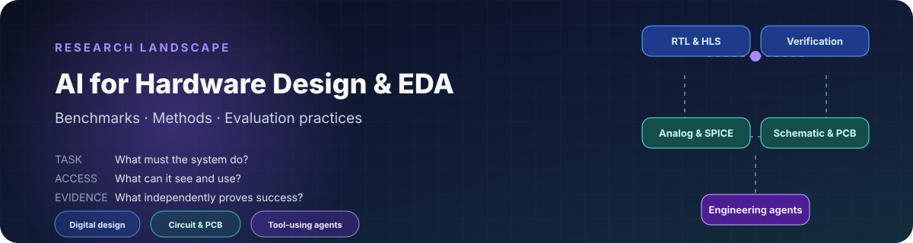
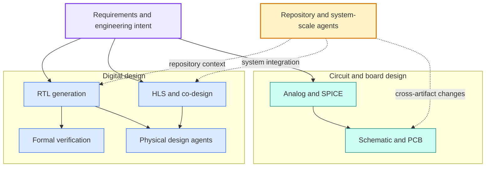

<div align="center">



# AI for Hardware Design & EDA

### A Survey of Benchmarks, Methods, and Evaluation Practices

**A living literature review of how AI and LLM agents are studied across the hardware-design stack.**

[](#project-status)
[](#benchmark-landscape)
[](data/benchmarks.csv)
[](research/README.md#current-contents)
[](#scope)
[](LICENSE)

[Start here](#what-is-this-project) · [Field guide](docs/field-guide.md) · [Research library](research/README.md) · [Roadmap](ROADMAP.md) · [Data](data/benchmarks.csv) · [Contribute](CONTRIBUTING.md)

</div>

## What is this project?

This project is a **structured survey of academic work on AI for hardware design and electronic design automation (EDA)**. We review the benchmarks researchers use, the methods they evaluate, the tools and verification environments involved, and the conclusions that can—and cannot—be drawn from reported results.

> **In one sentence:** we map what AI systems are asked to do in hardware engineering, how they are evaluated, and which reported claims are actually comparable.

The survey spans two engineering paths and the repository-scale systems that connect them:



We are **not** introducing a new model or benchmark in the current phase. The repository is the working companion to a new survey: it turns a fast-moving body of papers into a readable synthesis, a structured benchmark catalog, and a reproducible evidence base.

<details>
<summary><strong>中文简介</strong></summary>

本项目系统调研 AI/LLM 在硬件设计与电子设计自动化领域的学术论文、benchmark、方法和已有 survey，并在此基础上撰写一篇达到 arXiv 论文严谨程度的综述。当前阶段不是开发新的模型或 benchmark，而是回答：这个领域已有怎样的评测体系、不同工作究竟测了什么、结果是否可比，以及仍有哪些研究空白。

</details>

### Current snapshot

| Field map | Discovery catalog | Illustrated examples | Manuscript state |
|---:|---:|---:|---|
| **7** research directions | **22** seed systems | **7** worked benchmark cards | Outline and asset plan prepared |

These numbers describe the current structure, not completion. A seed entry is a discovery lead; it becomes paper evidence only after source and claim-level verification.

## Start reading

Choose the route that matches what you need:

| If you want to… | Read this | What you will get |
|---|---|---|
| Understand the field without prior EDA knowledge | [Field guide](docs/field-guide.md) | The seven directions, their inputs/outputs, evaluation methods, and current maturity |
| Decode unfamiliar hardware and evaluation terms | [Glossary](docs/glossary.md) | Plain-language definitions of RTL, HLS, oracle, PPA, DRC, PDK, Agent, and related terms |
| Read the current argument as an essay | [Survey blog draft](blog/from-rtl-generation-to-engineering-agents.md) | The shift from isolated RTL generation to verifier- and environment-grounded agents |
| Understand one benchmark precisely | [Research library](research/README.md) | Illustrated cards covering task, pipeline, oracle, limitations, and reproducibility |
| Compare the full landscape | [Benchmark catalog](data/benchmarks.csv) + [taxonomy](docs/taxonomy.md) | Structured records and a shared comparison vocabulary |
| Inspect how evidence is produced | [Research protocol](docs/research-notes.md) | Inclusion rules, source hierarchy, verification stages, and open questions |
| See how this becomes a paper | [Manuscript workspace](paper/README.md) | Planned sections, figures, tables, and their evidence dependencies |
| Track what is finished and what comes next | [Research roadmap](ROADMAP.md) | Milestones and exit criteria from seed map to archival release |

If you are new to the topic, follow the first three rows in order. They are the public reading layer; `data/`, templates, and protocol files are the research machinery behind it.

## Why this survey now?

Research has expanded well beyond text-to-Verilog generation. Recent work evaluates formal verification, repository-scale repair, HLS, physical-design agents, analog and SPICE workflows, board-level schematics, PCB routing, and hardware–software co-design.

The terminology has not kept pace. Papers described as “AI for hardware” may evaluate very different things: a single generated module, a question-answer dataset, a multi-file patch, or an agent operating a real EDA environment. Results are therefore difficult to compare without a common view of the task, context, interaction model, and correctness oracle.

This survey organizes that landscape and makes those differences explicit.

## Research questions

The survey is organized around six questions:

1. **What exists?** Which benchmarks, benchmark-bearing methods, datasets, and surveys define the field?
2. **What is evaluated?** Which hardware stage, task, input, and output does each work cover?
3. **How is success measured?** Does evaluation use text similarity, compilation, simulation, formal verification, synthesis, physical checks, or deployment?
4. **What kind of system is tested?** Is it a single-shot model, an iterative pipeline, or a tool-using agent?
5. **How realistic and reproducible is the setup?** Does it use synthetic exercises, real repositories, native tool environments, public code, and inspectable data?
6. **What is missing?** Which hardware-engineering capabilities remain weakly measured or absent from current benchmarks?

## What this repository provides

| Artifact | Purpose | Entry point |
|---|---|---|
| Field orientation | A non-specialist map of the current research landscape | [Field guide](docs/field-guide.md) |
| Survey synthesis | A readable account of the field, its evolution, and its open problems | [Blog draft](blog/from-rtl-generation-to-engineering-agents.md) |
| Benchmark catalog | Machine-readable records for the benchmark landscape | [CSV catalog](data/benchmarks.csv) |
| Research library | Reader-oriented benchmark and method cards with inputs, outputs, oracles, limitations, and diagrams | [Research library](research/README.md) |
| Comparison framework | Shared definitions for context, interaction, oracle strength, artifacts, and realism | [Taxonomy](docs/taxonomy.md) |
| Prior-survey comparison | What existing surveys cover and why a new synthesis is useful | [Related surveys](docs/related-surveys.md) |
| Research protocol | Scope, inclusion criteria, source hierarchy, and extraction plan | [Research notes](docs/research-notes.md) |
| Contribution path | Rules for proposing papers and correcting evidence | [Contributing guide](CONTRIBUTING.md) |

## Benchmark landscape

The current seed catalog contains **22 benchmark or benchmark-bearing systems**. Entries remain provisional until every claim has been checked against the primary paper and official release artifacts.

| Hardware area | Representative work | Main evaluation target |
|---|---|---|
| RTL generation | [VerilogEval](https://github.com/NVlabs/verilog-eval), [RTLLM](https://github.com/hkust-zhiyao/RTLLM), [CVDP](https://arxiv.org/abs/2506.14074) | Generate functionally correct HDL from specifications |
| Formal verification | [FVEval](https://github.com/NVlabs/FVEval), [AssertLLM](https://github.com/hkust-zhiyao/AssertLLM), [AssertLLM2](https://arxiv.org/abs/2605.27472) | Generate and assess verification assertions |
| Repository-scale RTL | [RTL-Repo](https://github.com/AUCOHL/RTL-Repo), [RTL-BenchLS](https://github.com/hkust-zhiyao/RTL-BenchLS), [HWE-Bench-Repair](https://github.com/pku-liang/hwe-bench) | Complete or repair hardware projects using repository context |
| HLS and co-design | [HLS-Eval](https://github.com/sharc-lab/hls-eval), [HSCO-Bench](https://github.com/B07901087/hsco_bench) | Generate accelerators and coordinate hardware–software integration |
| Physical design | [ChatEDA](https://github.com/wuhy68/ChatEDA), [PDAGENT-BENCH](https://arxiv.org/abs/2606.17253), [RTL-to-GDS agent case study](https://arxiv.org/abs/2607.17528) | Interpret reports, write scripts, and operate EDA workflows |
| Analog and SPICE | [AnalogGym](https://github.com/CODA-Team/AnalogGym), [AnalogCoder](https://ojs.aaai.org/index.php/AAAI/article/view/32016), [NetlistBench](https://arxiv.org/abs/2608.12197), [SpiceDiff-Agent](https://doi.org/10.1109/TCAD.2026.3729375) | Design, edit, size, or repair circuits under executable checks |
| Schematic and PCB | [HWE-Bench-Schematic](https://arxiv.org/abs/2603.18102), [PCB-QA](https://arxiv.org/abs/2606.23704), [PCBWorld](https://github.com/LGAI-Research/PCBWorld) | Generate or understand schematics and interact with PCB environments |

Browse the full catalog in [`data/benchmarks.csv`](data/benchmarks.csv). Field definitions and evidence rules are documented in [`data/SCHEMA.md`](data/SCHEMA.md).

## How we compare the literature

Two papers that both claim to evaluate “hardware design” may still test fundamentally different capabilities. We therefore code each work along five axes:

| Axis | Question asked |
|---|---|
| Context scale | Is the task an isolated problem, a multi-file design, a repository, or a complete system? |
| Interaction | Does the model answer once, iterate, call tools, or operate as a long-horizon agent? |
| Oracle strength | Is correctness based on text, compilation, simulation, formal proof, physical checks, or deployment? |
| Artifact breadth | Does the task involve one HDL file or coordinate code, verification, configuration, software, and board artifacts? |
| Engineering realism | Is the task synthetic, expert-curated, mined from history, executed natively, or deployed? |

The detailed coding rules are in the [taxonomy document](docs/taxonomy.md).

## Preliminary findings

These are working observations, not final survey claims:

1. **Evaluation is becoming more executable.** Newer work increasingly relies on simulation, formal verification, synthesis, EDA engines, SPICE, project regressions, or FPGA deployment rather than surface-level similarity alone.
2. **The unit of evaluation is expanding.** The field is moving from isolated RTL modules toward repositories, systems, and multi-stage engineering workflows.
3. **Agent design is part of the result.** Tool interfaces, scaffolds, budgets, and feedback loops can materially affect performance; reporting only the foundation model is often insufficient.
4. **Coverage remains uneven.** RTL generation and verification are comparatively mature, while existing-board modification, component selection, firmware integration, and cross-artifact validation are less systematically benchmarked.
5. **Names and claims require careful disambiguation.** Two unrelated 2026 works use the name “HWE-Bench”; this survey labels them `HWE-Bench-Repair` and `HWE-Bench-Schematic`.

Each observation will be revised or promoted only after source-level verification.

## Scope

Included work must make electronic or hardware design, verification, debugging, optimization, or EDA-tool operation central to the evaluated task. The review includes benchmarks, benchmark-bearing methods, and prior surveys.

Generic software benchmarks, generic CAD work without electronics relevance, and “hardware for AI” papers are outside scope unless the AI system itself performs a hardware-design task.

The literature cutoff for the current snapshot is **2026-09-19**. Recent work is preprint-heavy, so venue, code, and dataset availability must be rechecked before archival release.

## Project status

| Track | Current state | Next milestone |
|---|---|---|
| Literature discovery | Initial benchmark and survey landscape assembled | Expand backward and forward citations |
| Evidence audit | Links checked; catalog rows still marked `seed` | Verify every row against primary sources |
| Taxonomy | Five comparison axes drafted | Apply consistently and resolve edge cases |
| Writing | First synthesis essay drafted | Rewrite as a source-complete survey manuscript |
| Figures | Conceptual research diagrams drafted | Redraw publication figures after the evidence table stabilizes |

> **Important:** the current catalog is a research starting point, not a finalized systematic review. Quantitative claims should not be cited from this repository until the relevant row is marked `verified`.

The repository deliberately separates three levels of certainty:

- **Orientation:** readable explanations of what the field appears to contain.
- **Working evidence:** source-checked cards whose limits and unresolved questions remain visible.
- **Paper evidence:** cross-checked and frozen claims suitable for the final manuscript.

## Repository structure

```text
.
├── README.md                         # Public survey landing page
├── ROADMAP.md                        # Milestones and evidence exit criteria
├── assets/                           # Repository-native visual assets
├── blog/                             # Readable survey essays
├── data/
│   ├── benchmarks.csv                # Machine-readable benchmark catalog
│   └── SCHEMA.md                     # Field definitions and evidence rules
├── docs/
│   ├── field-guide.md                 # Non-specialist guide to the field
│   ├── glossary.md                    # Hardware, evaluation, and agent terminology
│   ├── research-notes.md             # Review protocol and open questions
│   ├── related-surveys.md            # Comparison with prior surveys
│   └── taxonomy.md                   # Comparison framework
├── research/
│   ├── benchmarks/                   # Illustrated, source-checked benchmark cards
│   ├── directions/                   # Map of survey directions and open work
│   └── templates/                    # Benchmark, method, and direction templates
├── paper/
│   └── README.md                      # Manuscript structure and planned figures/tables
├── scripts/
│   └── validate_catalog.py           # Catalog integrity checks
├── CITATION.cff
├── CONTRIBUTING.md
└── LICENSE
```

## Citation

The survey does not yet have an archival paper. Until a preprint is released, cite the repository metadata in [`CITATION.cff`](CITATION.cff) and include the accessed revision.

## License

Original text and structured research data in this repository are released under the [Creative Commons Attribution 4.0 International License](LICENSE), unless a file states otherwise. Linked papers, repositories, datasets, and other third-party artifacts remain under their respective owners' terms.
