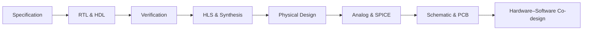

<div align="center">

# AI for Hardware Design & EDA

### A Survey of Benchmarks, Methods, and Evaluation Practices

**A living literature review of how AI and LLM agents are studied across the hardware-design stack.**

[](#project-status)
[](data/benchmarks.csv)
[](#scope)
[](LICENSE)

[Start here](#what-is-this-project) · [Research questions](#research-questions) · [Landscape](#benchmark-landscape) · [Findings](#preliminary-findings) · [Data](data/benchmarks.csv) · [Blog](blog/from-rtl-generation-to-engineering-agents.md) · [Contribute](CONTRIBUTING.md)

</div>

## What is this project?

This project is a **structured survey of academic work on AI for hardware design and electronic design automation (EDA)**. We review the benchmarks researchers use, the methods they evaluate, the tools and verification environments involved, and the conclusions that can—and cannot—be drawn from reported results.

The survey spans the hardware-design workflow:



We are **not** introducing a new model or benchmark in the current phase. The repository is the working companion to a new survey: it turns a fast-moving body of papers into a readable synthesis, a structured benchmark catalog, and a reproducible evidence base.

<details>
<summary><strong>中文简介</strong></summary>

本项目系统调研 AI/LLM 在硬件设计与电子设计自动化领域的学术论文、benchmark、方法和已有 survey，并在此基础上撰写一篇达到 arXiv 论文严谨程度的综述。当前阶段不是开发新的模型或 benchmark，而是回答：这个领域已有怎样的评测体系、不同工作究竟测了什么、结果是否可比，以及仍有哪些研究空白。

</details>

## Why this survey now?

Research has expanded well beyond text-to-Verilog generation. Recent work evaluates formal verification, repository-scale repair, HLS, physical-design agents, analog and SPICE workflows, board-level schematics, PCB routing, and hardware–software co-design.

The terminology has not kept pace. Papers described as “AI for hardware” may evaluate very different things: a single generated module, a question-answer dataset, a multi-file patch, or an agent operating a real EDA environment. Results are therefore difficult to compare without a common view of the task, context, interaction model, and correctness oracle.

This survey organizes that landscape and makes those differences explicit.

## Research questions

The survey is organized around six questions:

1. **What exists?** Which benchmarks, benchmark-bearing methods, datasets, and surveys define the field?
2. **What is evaluated?** Which hardware stage, task, input, and output does each work cover?
3. **How is success measured?** Does evaluation use text similarity, compilation, simulation, formal verification, synthesis, physical checks, or deployment?
4. **What kind of system is tested?** Is it a single-shot model, an iterative pipeline, or a tool-using agent?
5. **How realistic and reproducible is the setup?** Does it use synthetic exercises, real repositories, native tool environments, public code, and inspectable data?
6. **What is missing?** Which hardware-engineering capabilities remain weakly measured or absent from current benchmarks?

## What this repository provides

| Artifact | Purpose | Entry point |
|---|---|---|
| Survey synthesis | A readable account of the field, its evolution, and its open problems | [Blog draft](blog/from-rtl-generation-to-engineering-agents.md) |
| Benchmark catalog | Machine-readable records for the benchmark landscape | [CSV catalog](data/benchmarks.csv) |
| Comparison framework | Shared definitions for context, interaction, oracle strength, artifacts, and realism | [Taxonomy](docs/taxonomy.md) |
| Prior-survey comparison | What existing surveys cover and why a new synthesis is useful | [Related surveys](docs/related-surveys.md) |
| Research protocol | Scope, inclusion criteria, source hierarchy, and extraction plan | [Research notes](docs/research-notes.md) |
| Contribution path | Rules for proposing papers and correcting evidence | [Contributing guide](CONTRIBUTING.md) |

## Benchmark landscape

The current seed catalog contains **22 benchmark or benchmark-bearing systems**. Entries remain provisional until every claim has been checked against the primary paper and official release artifacts.

| Hardware area | Representative work | Main evaluation target |
|---|---|---|
| RTL generation | [VerilogEval](https://github.com/NVlabs/verilog-eval), [RTLLM](https://github.com/hkust-zhiyao/RTLLM), [CVDP](https://arxiv.org/abs/2506.14074) | Generate functionally correct HDL from specifications |
| Formal verification | [FVEval](https://github.com/NVlabs/FVEval), [AssertLLM](https://github.com/hkust-zhiyao/AssertLLM), [AssertLLM2](https://arxiv.org/abs/2605.27472) | Generate and assess verification assertions |
| Repository-scale RTL | [RTL-Repo](https://github.com/AUCOHL/RTL-Repo), [RTL-BenchLS](https://github.com/hkust-zhiyao/RTL-BenchLS), [HWE-Bench-Repair](https://github.com/pku-liang/hwe-bench) | Complete or repair hardware projects using repository context |
| HLS and co-design | [HLS-Eval](https://github.com/sharc-lab/hls-eval), [HSCO-Bench](https://github.com/B07901087/hsco_bench) | Generate accelerators and coordinate hardware–software integration |
| Physical design | [ChatEDA](https://github.com/wuhy68/ChatEDA), [PDAGENT-BENCH](https://arxiv.org/abs/2606.17253), [FluxBench](https://arxiv.org/abs/2607.17528) | Interpret reports, write scripts, and operate EDA workflows |
| Analog and SPICE | [AnalogGym](https://github.com/CODA-Team/AnalogGym), [AnalogCoder](https://ojs.aaai.org/index.php/AAAI/article/view/32016), [NetlistBench](https://arxiv.org/abs/2608.12197), [SpiceDiff-Agent](https://doi.org/10.1109/TCAD.2026.3729375) | Design, edit, size, or repair circuits under executable checks |
| Schematic and PCB | [HWE-Bench-Schematic](https://arxiv.org/abs/2603.18102), [PCB-QA](https://arxiv.org/abs/2606.23704), [PCBWorld](https://github.com/LGAI-Research/PCBWorld) | Generate or understand schematics and interact with PCB environments |

Browse the full catalog in [`data/benchmarks.csv`](data/benchmarks.csv). Field definitions and evidence rules are documented in [`data/SCHEMA.md`](data/SCHEMA.md).

## How we compare the literature

Two papers that both claim to evaluate “hardware design” may still test fundamentally different capabilities. We therefore code each work along five axes:

| Axis | Question asked |
|---|---|
| Context scale | Is the task an isolated problem, a multi-file design, a repository, or a complete system? |
| Interaction | Does the model answer once, iterate, call tools, or operate as a long-horizon agent? |
| Oracle strength | Is correctness based on text, compilation, simulation, formal proof, physical checks, or deployment? |
| Artifact breadth | Does the task involve one HDL file or coordinate code, verification, configuration, software, and board artifacts? |
| Engineering realism | Is the task synthetic, expert-curated, mined from history, executed natively, or deployed? |

The detailed coding rules are in the [taxonomy document](docs/taxonomy.md).

## Preliminary findings

These are working observations, not final survey claims:

1. **Evaluation is becoming more executable.** Newer work increasingly relies on simulation, formal verification, synthesis, EDA engines, SPICE, project regressions, or FPGA deployment rather than surface-level similarity alone.
2. **The unit of evaluation is expanding.** The field is moving from isolated RTL modules toward repositories, systems, and multi-stage engineering workflows.
3. **Agent design is part of the result.** Tool interfaces, scaffolds, budgets, and feedback loops can materially affect performance; reporting only the foundation model is often insufficient.
4. **Coverage remains uneven.** RTL generation and verification are comparatively mature, while existing-board modification, component selection, firmware integration, and cross-artifact validation are less systematically benchmarked.
5. **Names and claims require careful disambiguation.** Two unrelated 2026 works use the name “HWE-Bench”; this survey labels them `HWE-Bench-Repair` and `HWE-Bench-Schematic`.

Each observation will be revised or promoted only after source-level verification.

## Scope

Included work must make electronic or hardware design, verification, debugging, optimization, or EDA-tool operation central to the evaluated task. The review includes benchmarks, benchmark-bearing methods, and prior surveys.

Generic software benchmarks, generic CAD work without electronics relevance, and “hardware for AI” papers are outside scope unless the AI system itself performs a hardware-design task.

The literature cutoff for the current snapshot is **2026-09-19**. Recent work is preprint-heavy, so venue, code, and dataset availability must be rechecked before archival release.

## Project status

| Track | Current state | Next milestone |
|---|---|---|
| Literature discovery | Initial benchmark and survey landscape assembled | Expand backward and forward citations |
| Evidence audit | Links checked; catalog rows still marked `seed` | Verify every row against primary sources |
| Taxonomy | Five comparison axes drafted | Apply consistently and resolve edge cases |
| Writing | First synthesis essay drafted | Rewrite as a source-complete survey manuscript |
| Figures | Not started | Build figures only after the evidence table stabilizes |

> **Important:** the current catalog is a research starting point, not a finalized systematic review. Quantitative claims should not be cited from this repository until the relevant row is marked `verified`.

## How to read this project

- **New to the topic?** Start with the [survey blog draft](blog/from-rtl-generation-to-engineering-agents.md).
- **Comparing benchmarks?** Open the [catalog](data/benchmarks.csv) and [taxonomy](docs/taxonomy.md).
- **Positioning a new survey?** Read the [comparison with prior surveys](docs/related-surveys.md).
- **Checking methodology?** Read the [research protocol](docs/research-notes.md).
- **Adding or correcting a paper?** Follow [CONTRIBUTING.md](CONTRIBUTING.md).

## Repository structure

```text
.
├── README.md                         # Public survey landing page
├── blog/                             # Readable survey essays
├── data/
│   ├── benchmarks.csv                # Machine-readable benchmark catalog
│   └── SCHEMA.md                     # Field definitions and evidence rules
├── docs/
│   ├── research-notes.md             # Review protocol and open questions
│   ├── related-surveys.md            # Comparison with prior surveys
│   └── taxonomy.md                   # Comparison framework
├── scripts/
│   └── validate_catalog.py           # Catalog integrity checks
├── CITATION.cff
├── CONTRIBUTING.md
└── LICENSE
```

## Citation

The survey does not yet have an archival paper. Until a preprint is released, cite the repository metadata in [`CITATION.cff`](CITATION.cff) and include the accessed revision.

## License

Original text and structured research data in this repository are released under the [Creative Commons Attribution 4.0 International License](LICENSE), unless a file states otherwise. Linked papers, repositories, datasets, and other third-party artifacts remain under their respective owners' terms.
