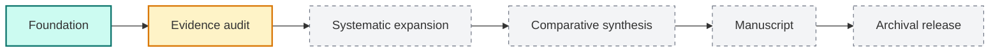

# Research roadmap

This roadmap separates repository construction from scientific completion. A polished landing page, a long bibliography, or a plausible synthesis is not enough to make a survey paper ready.

## Current position

**Foundation is complete; evidence audit is active.** Later milestones remain planned and should not be inferred from the existence of draft prose or templates.

## Milestones

### M0 · Research foundation — complete

The project has a stable public structure:

- a non-specialist [field guide](docs/field-guide.md) and [glossary](docs/glossary.md);
- seven research directions and a shared comparison taxonomy;
- a machine-readable seed catalog;
- one worked benchmark card per direction;
- benchmark, method, and direction templates;
- a manuscript section and asset plan;
- validation for the canonical catalog.

Completion here means that new research has a defined place to go. It does **not** mean the literature review is complete.

### M1 · Primary-source evidence audit — active

Each seed entry must be checked against the latest author-approved paper and official release artifacts.

Exit criteria:

- canonical title, date, venue, paper, code, and data links are reconciled;
- task input, expected output, interaction regime, environment, oracle, and metrics are extracted;
- headline results include their model, scaffold, split, budget, and metric context;
- missing artifacts and paper/repository conflicts are explicit;
- every retained entry is upgraded from `seed` or marked `needs-review` with a reason;
- important claims have source locations, not only URLs.

### M2 · Systematic literature expansion — planned

The seed map must become a documented search rather than an author-curated list.

Exit criteria:

- search sources, strings, dates, and inclusion/exclusion decisions are recorded;
- backward and forward citation expansion is complete for anchor papers and prior surveys;
- duplicates, renamed versions, and benchmark-name collisions are adjudicated;
- the literature cutoff is frozen for the manuscript snapshot;
- a screening flow and exclusion summary can be reproduced.

### M3 · Comparative synthesis — planned

Verified records must be converted into comparisons that do not erase experimental differences.

Exit criteria:

- every direction has benchmark and method-family comparison tables;
- results are grouped only when task contracts are genuinely comparable;
- oracle strength, context scale, interaction, artifact breadth, and realism are coded consistently;
- reproducibility, contamination, tool access, and budget limitations are compared across directions;
- findings and open problems are supported by multiple verified sources where possible;
- disagreements are preserved rather than averaged away.

### M4 · Survey manuscript — planned

The evidence library becomes a paper only after the comparison layer is stable.

Exit criteria:

- every substantive paragraph traces to cross-checked evidence;
- figures and tables have explicit sources and documented generation inputs;
- quantitative claims identify benchmark version and experimental setting;
- the manuscript clearly separates author-reported findings from our synthesis;
- limitations, search coverage, and unresolved evidence risks are stated;
- an internal consistency and citation audit passes.

### M5 · Archival release — planned

The manuscript, evidence snapshot, and repository state are frozen together.

Exit criteria:

- the final cutoff, catalog export, cards, figures, and manuscript agree;
- code and data needed to regenerate project-owned tables and figures are versioned;
- a tagged release and persistent archive identifier are created;
- citation metadata points to the archival paper or preprint;
- post-cutoff updates return to the living-survey branch rather than silently changing the paper snapshot.

## Definition of ready

### A direction is manuscript-ready when

- its scope and boundary are understandable without specialist knowledge;
- representative benchmarks expose input, output, interaction, oracle, metrics, and limitations;
- major method families have source-checked method cards;
- comparison tables do not mix incompatible evaluation contracts;
- at least one evidence-backed finding and one unresolved gap are recorded.

### A benchmark card is comparison-ready when

- paper and official artifacts have been inspected;
- task scale and provenance are explicit;
- the evaluator and success condition are unambiguous;
- reported results include the exact setting;
- reproducibility constraints and unsupported interpretations are visible.

### A claim is paper-ready when

- it is supported by primary evidence rather than the discovery draft;
- its scope does not exceed what the benchmark oracle establishes;
- conflicting or weaker evidence is acknowledged;
- another researcher can locate the supporting section, table, figure, or artifact.

## What this roadmap intentionally avoids

- Declaring a benchmark “best” before task contracts and budgets are normalized.
- Treating paper count as a measure of survey completeness.
- Converting all `seed` rows to `verified` without recording source-level evidence.
- Copying published figures when an original synthesis diagram can be drawn from verified facts.
- Expanding the manuscript faster than the evidence layer can support it.

Progress should be reported against exit criteria, not against document length.
