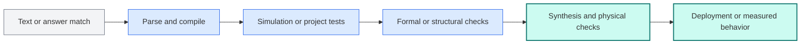

# Cross-benchmark evidence matrix

This matrix compares the seven worked examples in the research library under one evaluation vocabulary. It is a bridge between individual benchmark cards and the future survey tables—not a leaderboard.

Each row is backed by a source-checked card. The full 22-entry catalog remains a discovery index and should not be treated as equally verified evidence.

## What is being compared?

A benchmark is an evaluation contract: it specifies the task, inputs, outputs, allowed interaction, success oracle, and metrics. A method is the model, pipeline, or agent tested under that contract. Comparing model scores without first comparing these contracts can be misleading.

Use the matrix to ask three questions:

1. Does the system produce the same kind of artifact?
2. Does it receive the same context and opportunity to interact with tools?
3. Does an equally strong and independent oracle decide success?

## Seven representative evaluation contracts

| Direction and worked example | Typical input | Expected output | Evaluated interaction | Central success oracle | Main reproducibility constraint |
|---|---|---|---|---|---|
| RTL generation — [VerilogEval](../research/benchmarks/verilog-eval.md) | Partial implementation for the original completion harness, or natural-language specification for the revised harness | One Verilog module | Single-shot generation; evaluator runs tools afterward | Compilation and functional testbench simulation | Harness version, prompt, sampling, simulator, and pass@k protocol must be identified |
| Formal verification — [FVEval](../research/benchmarks/fveval.md) | Natural-language property and/or RTL design context | SystemVerilog Assertions | Single-shot model evaluation; evaluator invokes formal tools | Syntax plus equivalence, implication, or proof outcomes depending on subtask | Full released flow requires Cadence Jasper |
| Repository-scale RTL — [HWE-Bench-Repair](../research/benchmarks/hwe-bench-repair.md) | Historical issue plus complete hardware repository and container | Multi-file repository patch | Long-horizon coding agent using shell and repository tools | Project-native simulation and regression tests | Some OpenTitan images are not redistributed because of proprietary simulator requirements |
| HLS and co-design — [HLS-Eval](../research/benchmarks/hls-eval.md) | Natural-language specification or existing HLS C/C++ | Generated or optimized HLS design | Canonical baselines are single-shot; evaluator runs the toolchain | Staged parsing, compilation, C simulation, and HLS synthesis outcomes | Full synthesis reproduction depends on AMD Vitis HLS |
| Physical design agents — [RTL-to-GDS agent case study](../research/benchmarks/fluxbench.md) | PicoRV32 RTL, timing target, tool environment, and flow state | Tool actions, scripts, logs, and implemented design | Iterative tool-using agent | Executed synthesis and place-and-route flow with completion, quality, cost, and efficiency measures | Latest arXiv v3 reports one design, two clock targets, and a commercial 55 nm setup |
| Analog and SPICE — [NetlistBench](../research/benchmarks/netlistbench.md) | SPICE netlist plus a recognition question, equivalence task, or edit instruction | Answer or modified SPICE netlist | Single-shot recognition and manipulation | Deterministic structure-aware comparison | Structural correctness does not establish electrical performance in simulation |
| Schematic and PCB — [PCBWorld](../research/benchmarks/pcbworld.md) | Board state inside a KiCad-grounded routing environment | Routing actions and updated board state | Iterative tool-using agent | Native engine feedback, connectivity, and design-rule-related metrics | Exact tool versions, assets, budgets, and benchmark split must be pinned |

## The comparison axes

The same seven cases look different when coded along the survey's cross-cutting axes:

| Worked example | Context scale | Interaction regime | Oracle strength | Artifact breadth | Engineering realism |
|---|---|---|---|---|---|
| VerilogEval | Isolated task | Single-shot | Executable simulation | One RTL module | Curated problem with testbench |
| FVEval | Isolated design/property | Single-shot | Formal | Assertions and verification collateral | Expert and synthetic tasks in a formal flow |
| HWE-Bench-Repair | Full repository | Long-horizon agent | Native project tests | Multi-file patch | Historical issue in containerized projects |
| HLS-Eval | Bounded design | Single-shot baseline | Simulation and synthesis | HLS C/C++ design | Toolchain-grounded curated tasks |
| RTL-to-GDS agent case study | One complete design flow | Long-horizon tool-using agent | Executed EDA flow | Scripts, reports, and layout artifacts | Commercial process and tools, narrow design sample |
| NetlistBench | One netlist task | Single-shot | Deterministic structural check | Answer or SPICE netlist | Controlled structural task suite |
| PCBWorld | Native board environment | Tool-using agent | Engine and physical checks | PCB routing state | KiCad-grounded synthetic and real boards |

These columns are descriptive, not ordinal. “Repository-scale” is not automatically better than “isolated,” and a formal oracle is not automatically appropriate for a PCB-routing task. The purpose is to prevent unlike tasks from being collapsed into one ranking.

## Oracle ladder

Evaluation tends to become more persuasive as it moves from surface agreement toward independent execution, but the appropriate endpoint depends on the artifact:

This is a reasoning aid rather than a universal total order. For example, deterministic structural checking can be the right oracle for a netlist-edit task, while system deployment may be necessary for a hardware–software integration claim.

## What can be compared safely?

- Compare methods within the same benchmark only when the split, prompt/scaffold, tool access, budget, sampling, and metric are aligned.
- Compare benchmarks at the capability level—context, interaction, oracle, artifacts, and realism—rather than by raw score.
- Treat evaluator-side tool execution and agent-side tool use as different experimental regimes.
- Report failure stages where possible; a single pass rate can hide parsing, compilation, simulation, synthesis, and integration failures.
- Keep result claims provisional until the exact model, benchmark version, split, and evaluation configuration are recorded.

## Evidence boundary

This is a first comparison over one worked example per research direction. It does not yet represent every benchmark in the seed catalog, establish field-wide rankings, or quantify coverage statistically. Expanding the matrix requires source-checking the remaining entries and adjudicating ambiguous fields before they are promoted into manuscript evidence.

For definitions and coding rules, continue to the [taxonomy](taxonomy.md). For the underlying evidence, open the [research library](../research/README.md).
