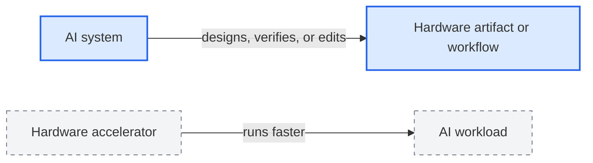
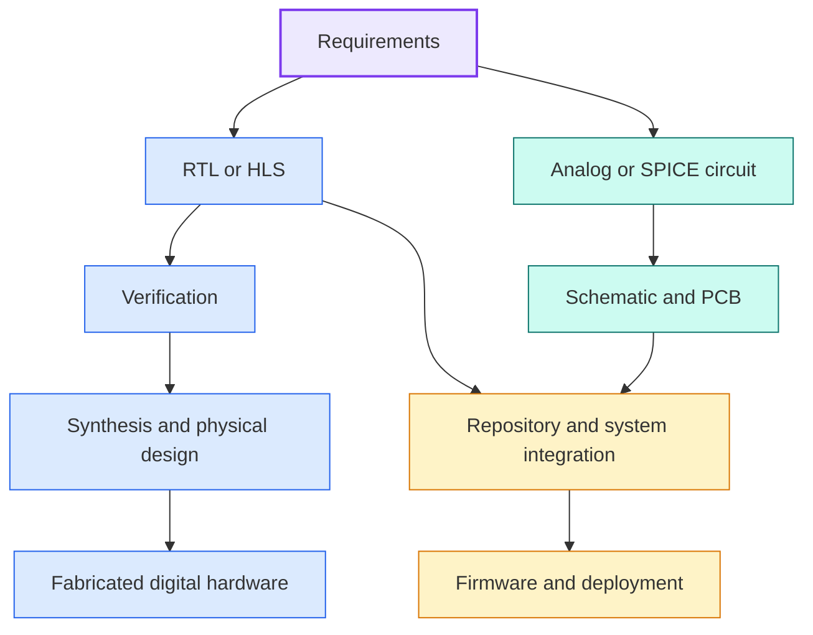
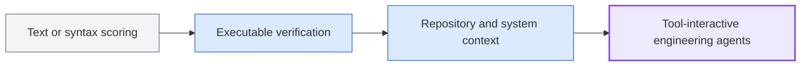
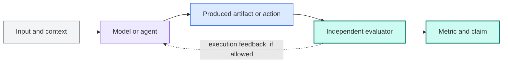

# Field guide: AI for hardware design and EDA

This is the shortest route from “I do not know this field” to understanding what current research is actually testing. It is an orientation document, not a final survey conclusion. Statements become paper-ready only after the underlying evidence is cross-checked.

Terms such as RTL, HLS, oracle, PPA, and DRC are defined in the [plain-language glossary](glossary.md).

## 1. What field are we studying?

This survey studies **AI systems that perform or assist hardware-engineering work**: writing RTL, generating verification properties, repairing repositories, operating EDA tools, manipulating circuits, and working with schematics or PCB layouts.

It does **not** primarily study hardware accelerators for running AI. The direction of assistance is the distinction:

This repository covers the upper path.

Two terms recur throughout the repository:

- A **method** is the model, pipeline, or agent proposed to do the work.
- A **benchmark** is the task collection and evaluation contract used to test a method.

A benchmark result is meaningful only together with its inputs, allowed tools, budget, success oracle, and metric. Methods evaluated under different contracts should not be placed in a single ranking without qualification.

## 2. The field in one picture

Research can be located along the hardware workflow, but the stages do not form a perfectly linear process in real projects.

The central survey question is not simply “Can AI design hardware?” It is:

> Given a particular engineering input, what artifact or action must the AI produce, what context and tools may it use, and what independent evidence determines success?

## 3. Seven research directions

| Direction | Typical input | Expected output | Typical interaction | Strongest common evaluator | Current picture |
|---|---|---|---|---|---|
| RTL generation | Natural-language specification or partial HDL | Verilog/SystemVerilog module | Usually single shot | Compilation plus functional testbench | Most established benchmark family; usually isolated tasks |
| Formal verification | Property description, testbench context, or RTL | Assertions and supporting formal code | Usually single shot; tool run by evaluator | Formal equivalence or proof | Strong oracle, but often dependent on commercial tools |
| Repository-scale RTL | Issue description, repository, and build environment | One- or multi-file patch | Long-horizon coding agent | Native project verification | More realistic context; leakage and environment maintenance are difficult |
| HLS and co-design | Specification or existing C/C++ and system context | Synthesizable accelerator and sometimes integration code | Single shot through tool-using agent | Simulation, synthesis, or deployment | Executable HLS stages exist; full system integration is less established |
| Physical-design agents | RTL, constraints, reports, technology setup, and EDA state | Scripts/actions and implemented-design artifacts | Long-horizon tool-using agent | Executed EDA stages and physical metrics | Agent scaffold, tool version, PDK, and budget materially affect results |
| Analog and SPICE | Circuit requirements or existing netlist | Answer, topology, parameters, or edited netlist | Single shot or simulator-in-the-loop | Structural equivalence or SPICE simulation | Structural and electrical claims use different oracles; evaluation remains fragmented |
| Schematic and PCB | Requirements or native board artifacts | Answer, schematic, layout, or routing actions | Single shot or interactive routing | Answer checks, ERC/DRC, and native engine metrics | Routing is increasingly executable; product-level cross-artifact changes remain weakly measured |

For the named benchmarks, claim boundaries, maturity assessment, and one worked example per direction, continue to the [research direction map](../research/directions/README.md).

## 4. Why benchmark results are hard to compare

Two papers can both report success on “AI for hardware” while testing different capabilities. We compare them along five questions:

1. **Context:** Is the system given one problem, several files, a repository, or a whole system?
2. **Interaction:** Does it answer once, revise iteratively, call tools, or act over a long horizon?
3. **Oracle:** Is success judged by text, compilation, simulation, formal proof, physical checks, or deployment?
4. **Artifact breadth:** Does it change one HDL file or coordinate code, verification, configuration, firmware, and board artifacts?
5. **Realism:** Is the task synthetic, expert-curated, mined from real history, executed natively, or deployed?

The most important caution is that **an evaluator running a tool after generation does not make the evaluated model a tool-using agent**. The system is tool-using only when tool feedback can influence its next action.

The precise definitions live in the [taxonomy](taxonomy.md).

## 5. The broad trajectory

Our current working synthesis sees four overlapping transitions:

- **From resemblance to execution:** compilation, simulation, formal methods, synthesis, DRC, and deployment increasingly replace surface similarity.
- **From modules to projects:** repository tasks expose search, dependency reasoning, fault localization, and multi-file coordination.
- **From models to systems:** prompts, scaffolds, tool interfaces, budgets, and stopping rules become part of what is being evaluated.
- **From one artifact to engineering change:** the frontier is coordination across representations, not merely generation of one valid file.

These are provisional synthesis claims. They are useful for navigating the literature, but will be revised as the evidence audit advances.

## 6. What appears mature—and what does not

### Relatively established

- Isolated RTL generation with compiler and testbench evaluation.
- Assertion generation and formal-verification-oriented tasks.
- Clear conventions for reporting executable pass rates on bounded problems.

### Growing quickly

- Repair of real RTL repositories.
- Tool-interactive physical-design and EDA agents.
- HLS and hardware–software co-design evaluation.
- Simulator-grounded analog and netlist manipulation.

### Still weakly covered

- Coordinated modification of an existing schematic, PCB, BOM, and firmware.
- Electrical intent that is not captured by ERC/DRC alone.
- Cross-tool and cross-PDK reproducibility.
- Stable comparisons of agent systems with different budgets and permissions.
- Contamination controls for public repositories and historical fixes.

“Weakly covered” means that the current search has not found a mature, widely adopted evaluation setup—not that no relevant paper exists.

## 7. How to inspect one benchmark

Every completed benchmark card answers the same sequence:

A useful card must also explain what the benchmark **does not** demonstrate. For example, passing an RTL testbench does not establish physical quality, and passing PCB design-rule checks does not establish that a board fulfills its intended electrical function.

Start with these contrasting examples:

- [VerilogEval](../research/benchmarks/verilog-eval.md): isolated specification-to-RTL generation.
- [HWE-Bench-Repair](../research/benchmarks/hwe-bench-repair.md): agentic repair in complete RTL repositories.
- [PCBWorld](../research/benchmarks/pcbworld.md): interactive routing in a native PCB environment.

## 8. What is known versus still being built

| Layer | Current state | How to use it |
|---|---|---|
| Field map | Seven directions and 22 seed systems identified | Use for orientation and discovery |
| Worked evidence | One source-checked benchmark card per direction | Use to understand task shape; check stated limits |
| Full comparison | Row-level verification still in progress | Do not treat provisional counts or rankings as final |
| Survey manuscript | Structure and asset plan prepared | Not yet an archival paper |

The visible uncertainty is intentional. A credible survey should make incomplete verification easy to see rather than presenting a polished but unsupported conclusion.

## 9. Continue reading

1. Read the [survey blog draft](../blog/from-rtl-generation-to-engineering-agents.md) for the current narrative.
2. Browse the [research library](../research/README.md) for benchmark diagrams and evidence cards.
3. Use the [catalog](../data/benchmarks.csv) when you need the complete structured list.
4. Read the [research protocol](research-notes.md) to understand how provisional entries become manuscript evidence.
