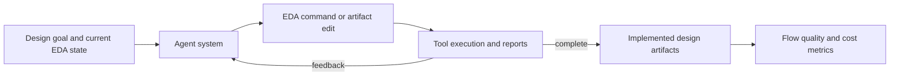

# FluxBench

| Field | Value |
|---|---|
| Research direction | Tool-interactive physical design and RTL-to-GDS workflows |
| Paper | [Can AI Agents Really Complete RTL-to-GDS? Lessons from Benchmarking Tool-Interactive EDA Workflows](https://arxiv.org/abs/2607.17528) |
| Official artifacts | Public benchmark code not located in the initial source pass |
| First public year / venue | 2026 / arXiv |
| Verification status | `source-checked` for paper abstract and task framing; artifact and result audit pending |
| Last checked | 2026-09-19 |

## One-sentence definition

FluxBench compares complete AI agent systems on matched, tool-interactive EDA workflows spanning RTL generation through downstream implementation tasks.

## Why it exists

Model-only comparisons obscure the effect of the agent scaffold, tool interface, feedback loop, and execution budget. FluxBench evaluates systems under shared prompts, tool environments, and technology settings.

## Benchmark anatomy

| Component | Description |
|---|---|
| Evaluation unit | One executable EDA workflow or design-flow scenario |
| Input | Design goal plus access to an EDA environment and its evolving state |
| Expected output | RTL, repaired RTL, synthesis/P&R artifacts, or ECO results depending on scenario |
| Dataset source | Representative RTL and RTL-to-GDS workflows, including a PicoRV32 case study |
| Scale | Multiple workflow families; a canonical task-count extraction is still pending |
| Interaction | Long-horizon, tool-using agent |
| Environment | Open-source and commercial EDA tools under matched settings |
| Success oracle | Executed flow outcomes and artifact/quality metrics |
| Metrics | Task performance, end-to-end flow scores, token/runtime cost, and Token ROI |

## Evaluation pipeline

## What it demonstrates

- That agent architecture and tool-use design are experimental variables, not implementation details.
- Whether a system can use execution feedback across longer EDA workflows.

## What it does not demonstrate

- General repository issue resolution or board-level engineering.
- Fully reproducible cross-lab comparison until public code, environment details, and commercial-tool access are resolved.

## Reproducibility

| Artifact | Availability | Notes |
|---|---|---|
| Paper | Yes | Public preprint |
| Dataset | Not located | Requires follow-up with the authors' release artifacts |
| Evaluator | Not located | Paper describes matched environments |
| Environment | Mixed | Includes commercial EDA settings |

## Open questions

- Which conclusions remain stable across tool versions, PDKs, and agent budgets?
- How can commercial-flow results be independently reproduced?
