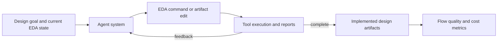

# RTL-to-GDS agent case study

| Field | Value |
|---|---|
| Research direction | Tool-interactive physical design and RTL-to-GDS workflows |
| Catalog label | `fluxbench` is a repository-local identifier; the paper does not name its evaluation “FluxBench” |
| Paper | [Can AI Agents Really Complete RTL-to-GDS? Lessons from Benchmarking Tool-Interactive EDA Workflows](https://arxiv.org/abs/2607.17528) |
| Source version | arXiv v3, 23 July 2026; earlier indexed descriptions may reflect a broader superseded framing |
| Official artifacts | Public benchmark package not located |
| First public year / venue | 2026 / arXiv |
| Verification status | `source-checked` for the paper's task, setup, metrics, and limitations; independent reproduction pending |
| Last checked | 2026-09-21 |

## One-sentence definition

This focused case study compares complete AI agent systems on one PicoRV32 RTL-to-GDS flow under two timing targets.

## Why it exists

Model-only comparisons obscure the effect of the agent scaffold, tool interface, feedback loop, and execution budget. The study holds one design and commercial technology setup fixed while varying agent architecture and foundation model.

## Benchmark anatomy

| Component | Description |
|---|---|
| Evaluation unit | One PicoRV32 RTL-to-GDS run at either a 350 MHz or 700 MHz clock target |
| Input | Fixed PicoRV32 RTL, timing constraints, commercial 55 nm technology setup, and evolving EDA state |
| Expected output | Gate-level netlist, placed-and-routed layout data, timing/QoR reports, and final GDS-related deliverables |
| Dataset source | PicoRV32 case study selected by the paper authors |
| Scale | One design, two timing targets, three agent architectures, and four foundation models; one run per configuration |
| Interaction | Long-horizon, tool-using agent |
| Environment | Commercial synthesis and physical-design tools in one 55 nm setup |
| Success oracle | Stage-gated completion plus metrics extracted from produced implementation artifacts and reports |
| Metrics | End-to-end design score, stage completion, area, power, setup/hold timing, token cost, runtime, Token ROI, and failure category |

## Evaluation pipeline

## What it demonstrates

- How three agent architectures behave on the stated PicoRV32 flow under matched constraints.
- That tool-interface and persistent-state design can materially affect completion, cost, and measured QoR in this setup.

## What it does not demonstrate

- General repository issue resolution or board-level engineering.
- Generalization across designs, PDKs, tool versions, repeated stochastic runs, or foundation models beyond the evaluated combinations.
- A model-only ranking: the measured unit is the complete model-plus-agent architecture.

## Reproducibility

| Artifact | Availability | Notes |
|---|---|---|
| Paper | Yes | Public preprint |
| Benchmark package | Not located | The paper describes the setup, but no public task bundle was located |
| Evaluator | Not located | Score and Token ROI are defined in the paper |
| Environment | Restricted | Commercial tools and the 55 nm technology setup limit independent reproduction |

## Open questions

- Which conclusions remain stable across tool versions, PDKs, and agent budgets?
- Do the architecture comparisons remain stable over repeated runs and additional designs?
- How can the commercial-flow result be independently reproduced?
