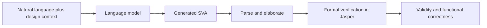

# FVEval

| Field | Value |
|---|---|
| Research direction | Formal verification |
| Paper | [FVEval: Understanding Language Model Capabilities in Formal Verification of Digital Hardware](https://arxiv.org/abs/2410.23299) |
| Official artifacts | [NVlabs/FVEval](https://github.com/NVlabs/FVEval) |
| First public year / venue | 2024 preprint / DATE 2025 |
| Verification status | `source-checked` for task families and tool requirements; result audit pending |
| Last checked | 2026-09-19 |

## One-sentence definition

FVEval measures language-model capability on progressively harder formal-verification tasks centered on generating SystemVerilog Assertions.

## Why it exists

Passing an RTL testbench does not show whether a model can express design intent as formal properties. FVEval treats verification collateral itself as the generated artifact and evaluates it with a formal tool.

## Benchmark anatomy

| Component | Description |
|---|---|
| Evaluation unit | One natural-language-to-SVA or design-to-SVA verification task |
| Input | Natural-language property descriptions, testbench/design context, or RTL depending on sub-benchmark |
| Expected output | SystemVerilog Assertions or design-level verification properties |
| Dataset source | Expert-written collateral plus scalable synthetic examples aligned with formal-verification workflows |
| Scale | Multiple sub-benchmarks; exact instance counts and splits remain to be extracted from the paper |
| Interaction | Canonically single-shot model evaluation; the evaluator invokes formal tools externally |
| Environment | Cadence Jasper, as required by the released evaluation flow |
| Success oracle | Syntax and formal-verification-oriented property checks, including equivalence-oriented evaluation where applicable |
| Metrics | Task-specific functional correctness and pass@k-style reporting |

## Evaluation pipeline

## What it demonstrates

- Whether a model can translate design intent into formally checkable assertions.
- How performance changes as the input moves from directed natural-language properties toward design-level reasoning.

## What it does not demonstrate

- That the evaluated model autonomously operates the formal tool; in the canonical setup, tool execution belongs to the evaluator.
- Complete verification coverage of a production design.

## Reproducibility

| Artifact | Availability | Notes |
|---|---|---|
| Paper | Yes | Public preprint and DATE record |
| Dataset | Yes | Released in the official repository |
| Evaluator | Yes | Scripts and task data are public |
| Environment | Commercial | Full evaluation requires Cadence Jasper access |

## Open questions

- Which results can be reproduced without the commercial formal tool?
- How should assertion usefulness be compared across syntax, provability, coverage, and bug-finding power?
