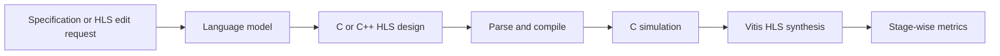

# HLS-Eval

| Field | Value |
|---|---|
| Research direction | High-level synthesis |
| Paper | [HLS-Eval: A Benchmark and Framework for Evaluating LLMs on High-Level Synthesis Design Tasks](https://arxiv.org/abs/2504.12268) |
| Official artifacts | [sharc-lab/hls-eval](https://github.com/sharc-lab/hls-eval) |
| First public year / venue | 2025 / ICLAD |
| Verification status | `source-checked` for task, scale, and evaluation stages; result audit pending |
| Last checked | 2026-09-21 |

## One-sentence definition

HLS-Eval evaluates language models on generating and editing C/C++ designs intended for high-level synthesis.

## Why it exists

RTL benchmarks do not capture the constraints of HLS programming, where C/C++ must be functionally correct and acceptable to a synthesis tool while exposing hardware efficiency tradeoffs.

## Benchmark anatomy

| Component | Description |
|---|---|
| Evaluation unit | One HLS design generation or optimization/edit task |
| Input | Natural-language design description, or existing HLS code plus an edit/optimization request |
| Expected output | C/C++ HLS implementation |
| Dataset source | Standard HLS benchmarks and novel designs prepared with descriptions and testbenches |
| Scale | 94 unique designs |
| Interaction | Baselines are primarily single-shot; framework supports broader interaction experiments |
| Environment | C/C++ execution and AMD/Xilinx Vitis HLS synthesis |
| Success oracle | Parsing, compilation, C-simulation, and successful synthesis |
| Metrics | Parseability, compilability, runnability, synthesizability, and pass@k |

## Evaluation pipeline

## What it demonstrates

- Where generated HLS code fails across distinct stages rather than reporting only one aggregate outcome.
- Whether a model can produce software-like code that remains meaningful to a hardware synthesis flow.

## What it does not demonstrate

- Full SoC integration, software mapping, physical implementation, or deployment of every generated accelerator.
- Direct comparability to RTL benchmarks with different task definitions and oracles.

## Reproducibility

| Artifact | Availability | Notes |
|---|---|---|
| Paper | Yes | Public preprint |
| Dataset | Yes | Released with the framework |
| Evaluator | Yes | Modular Python evaluation framework is public |
| Environment | Mixed | General framework is open; canonical synthesis depends on Vitis HLS |

## Open questions

- How should quality-of-results metrics be normalized across devices and HLS versions?
- Which tasks require iterative tool feedback rather than single-shot code generation?
