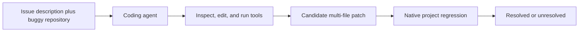

# HWE-Bench-Repair

| Field | Value |
|---|---|
| Research direction | Repository-scale RTL repair |
| Paper | [HWE-Bench: Benchmarking LLM Agents on Real-World Hardware Bug Repair Tasks](https://arxiv.org/abs/2604.14709) |
| Official artifacts | [pku-liang/hwe-bench](https://github.com/pku-liang/hwe-bench) · [Dataset](https://huggingface.co/datasets/henryen/hwe-bench) |
| First public year / venue | 2026 / arXiv |
| Verification status | `source-checked` for task construction, scale, harness, and environment boundary; detailed result audit pending |
| Last checked | 2026-09-21 |

## One-sentence definition

HWE-Bench-Repair evaluates coding agents on historical hardware bug fixes inside complete open-source RTL repositories.

## Why it exists

Isolated RTL generation hides repository navigation, fault localization, build systems, configuration, verification collateral, and multi-file coordination. This benchmark adapts the issue-to-patch paradigm to real hardware projects.

## Benchmark anatomy

| Component | Description |
|---|---|
| Evaluation unit | One historical bug-fix task reconstructed from an upstream change |
| Input | Problem statement plus a complete repository and containerized project environment |
| Expected output | A repository patch that resolves the target failure without breaking the regression flow |
| Dataset source | Historical fixes from ibex, cva6, caliptra-rtl, rocket-chip, XiangShan, and OpenTitan |
| Scale | 417 tasks across six open-source hardware projects |
| Interaction | Long-horizon coding agent with shell, repository, and test interaction |
| Environment | Per-task containers plus project-native build, simulation, and regression commands |
| Success oracle | Fail-to-pass verification: the task test fails on the buggy revision and passes after a valid fix |
| Metrics | Resolved-task rate and project/category breakdowns |

## Evaluation pipeline

## What it demonstrates

- Whether an agent can navigate and repair realistic hardware repositories under executable project tests.
- Performance on fault localization and cross-file changes absent from module-level generation benchmarks.

## What it does not demonstrate

- Board-level schematic/PCB work, component selection, embedded firmware integration, or unrestricted hardware-product development.
- Correctness beyond the benchmark's reconstructed tests and project regressions.

## Reproducibility

| Artifact | Availability | Notes |
|---|---|---|
| Paper | Yes | Public preprint |
| Dataset | Yes | Public JSONL datasets for all 417 tasks |
| Evaluator | Yes | Harness, adapters, and evaluator are public |
| Environment | Mixed | Images are published for the 172 non-OpenTitan tasks; 245 OpenTitan tasks require a locally licensed Synopsys VCS setup |

## Open questions

- How should public historical fixes be protected from memorization and web leakage?
- How stable are native project tests and containers over long-term benchmark maintenance?
