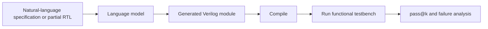

# VerilogEval

| Field | Value |
|---|---|
| Research direction | RTL generation |
| Paper | [VerilogEval: Evaluating Large Language Models for Verilog Code Generation](https://arxiv.org/abs/2309.07544) |
| Official artifacts | [NVlabs/verilog-eval](https://github.com/NVlabs/verilog-eval) |
| First public year / venue | 2023 / ICCAD |
| Verification status | `source-checked` for task and repository structure; result audit pending |
| Last checked | 2026-09-19 |

## One-sentence definition

VerilogEval evaluates whether a language model can complete or generate Verilog modules that satisfy executable testbenches.

## Why it exists

Generic code-generation benchmarks do not test HDL semantics such as timing, state, and concurrent behavior. VerilogEval established a standardized, execution-based baseline for language-model RTL generation.

## Benchmark anatomy

| Component | Description |
|---|---|
| Evaluation unit | One HDLBits-derived Verilog design problem |
| Input | A partial implementation for code completion, or a natural-language specification for specification-to-RTL |
| Expected output | A Verilog module matching the required interface and behavior |
| Dataset source | Human-authored HDL problems adapted into evaluation prompts and testbenches |
| Scale | 156 problems in the original human-authored set; repository versions should be reported explicitly |
| Interaction | Single-shot generation in the canonical setting |
| Environment | Verilog compilation and simulation; the current repository documents Icarus Verilog-based execution |
| Success oracle | Compiles and passes the associated functional testbench |
| Metrics | pass@k and failure categories, depending on repository version |

## Evaluation pipeline

## What it demonstrates

- Whether generated RTL is syntactically valid and passes the provided functional tests.
- A reproducible baseline for comparing models on isolated specification-to-RTL tasks.

## What it does not demonstrate

- Repository understanding, multi-file integration, tool-interactive repair, physical implementation, or general correctness beyond the provided tests.
- Whether a passing design has competitive power, performance, and area.

## Reproducibility

| Artifact | Availability | Notes |
|---|---|---|
| Paper | Yes | Public arXiv paper and archival citation |
| Dataset | Yes | Problem directories are included in the official repository |
| Evaluator | Yes | Generation and analysis scripts are public |
| Environment | Open | Current setup documents Python and Icarus Verilog; version must be recorded |

## Open questions

- How comparable are results reported on the original and revised repository versions?
- How much functional behavior remains under-specified by the provided tests?
