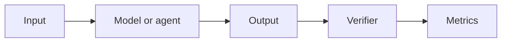

# Benchmark name

| Field | Value |
|---|---|
| Research direction | `TODO` |
| Paper | `TODO` |
| Official artifacts | `TODO` |
| First public year / venue | `TODO` |
| Verification status | `seed` |
| Last checked | `YYYY-MM-DD` |

## One-sentence definition

What capability does this benchmark measure?

## Why it exists

Which limitation in earlier evaluation motivated it?

## Benchmark anatomy

| Component | Description |
|---|---|
| Evaluation unit | One problem, module, issue, repository, board, flow, or system |
| Input | Exact artifacts visible to the evaluated system |
| Expected output | Exact artifact or action sequence submitted for evaluation |
| Dataset source | Human-authored, synthetic, mined, or native-project source |
| Scale | Tasks, projects, designs, categories, and splits |
| Interaction | Single-shot, iterative, tool-using, or long-horizon agent |
| Environment | Compiler, simulator, formal tool, EDA engine, container, or hardware |
| Success oracle | How correctness is determined |
| Metrics | Primary and secondary reported metrics |

## Evaluation pipeline

## Baselines and reported findings

Record only results whose model, split, metric, and evaluation setting have been checked.

| Claim | Setting | Evidence |
|---|---|---|
| `TODO` | `TODO` | Section/table/figure in primary source |

## What the benchmark demonstrates

- `TODO`

## What it does not demonstrate

- `TODO`

## Reproducibility

| Artifact | Availability | Notes |
|---|---|---|
| Paper | `yes/no` | `TODO` |
| Dataset | `yes/no/partial/not located` | `TODO` |
| Evaluator | `yes/no/partial/not located` | `TODO` |
| Environment | `open/commercial/mixed/not located` | `TODO` |

## Evidence notes

- Keep short paraphrases and precise source locations here.
- Separate author claims from our interpretation.
- Record conflicts between paper, repository, and later versions.

## Open questions

- `TODO`
