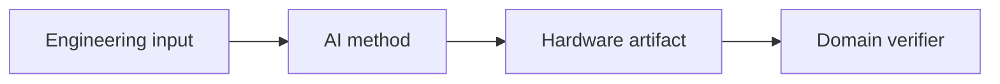

# Direction name

## Definition and boundary

What belongs in this direction, and which adjacent work is excluded?

## Why the problem matters

Explain the hardware-engineering context for a reader who is not a specialist in this stage.

## Typical task pipeline

## Evolution of the literature

Organize representative work chronologically and explain substantive transitions.

## Benchmark comparison

| Benchmark | Input | Output | Scale | Interaction | Oracle | Open artifacts |
|---|---|---|---:|---|---|---|
| `TODO` | `TODO` | `TODO` | `TODO` | `TODO` | `TODO` | `TODO` |

## Method families

| Family | Core idea | Representative work | Strength | Limitation |
|---|---|---|---|---|
| `TODO` | `TODO` | `TODO` | `TODO` | `TODO` |

## Evidence-backed findings

Each finding should link to one or more source-checked cards.

## Disagreements and gaps

Record incompatible definitions, incomparable metrics, missing controls, and under-evaluated capabilities.

## Planned paper assets

- Section thesis:
- Comparison table:
- Method figure:
- Benchmark figure:
- Open-problem callout:
