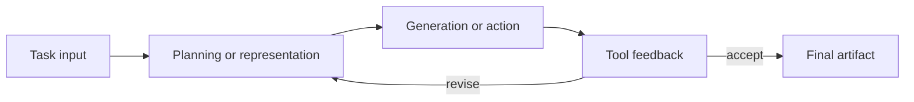

# Method name

| Field | Value |
|---|---|
| Research direction | `TODO` |
| Paper | `TODO` |
| Official implementation | `TODO` |
| Verification status | `seed` |
| Last checked | `YYYY-MM-DD` |

## Problem and core idea

State the problem and the proposed idea in plain language.

## Method pipeline

## Components

| Component | Role | Learned or fixed? | External dependency |
|---|---|---|---|
| `TODO` | `TODO` | `TODO` | `TODO` |

## Training and inference

- Training data and objective: `TODO`
- Prompting or adaptation: `TODO`
- Inference budget and stopping condition: `TODO`
- Tools and permissions: `TODO`

## Evaluation contract

| Benchmark | Baseline | Metric | Reported result | Evidence location |
|---|---|---|---|---|
| `TODO` | `TODO` | `TODO` | `TODO` | `TODO` |

## Ablations and failure modes

- `TODO`

## Survey interpretation

What does this method add to the direction, and what should not be generalized from its evaluation?
